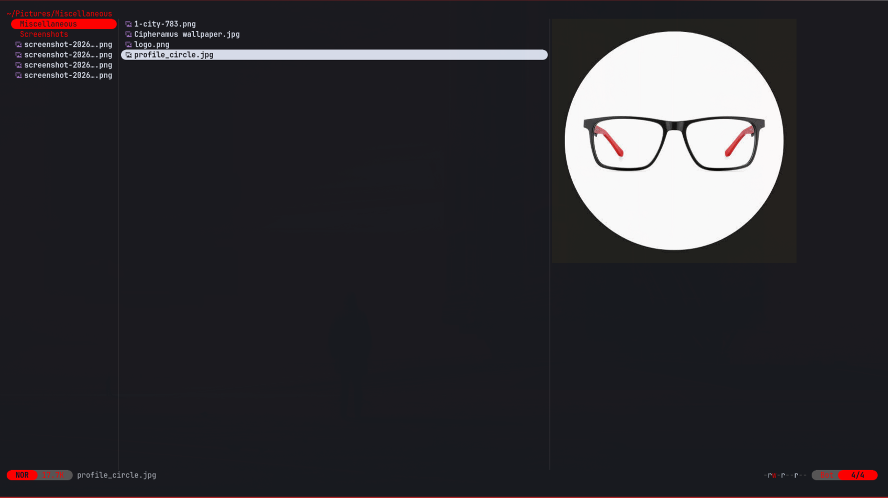

<div align="center">
  
</div>

<h3 align="center">
	Cipheramus, a flavor for <a href="https://github.com/sxyazi/yazi">Yazi</a>
</h3>

<p align="center">
	A dark, red-accented flavor ported from my <a href="https://github.com/jandedobbeleer/oh-my-posh">oh-my-posh</a> prompt theme,
	built on the <a href="https://github.com/sdras/night-owl-vscode-theme">Night Owl</a> palette.
</p>

## 👀 Preview



## 🎨 Installation

```sh
ya pkg add IbnSaad2910/cipheramus
```

## ⚙️ Usage

To set it as your dark flavor, change the content of your `theme.toml` to:

```toml
[flavor]
dark = "cipheramus"
```

Make sure your `theme.toml` doesn't contain anything other than `[flavor]`, unless you want to override certain styles of this flavor.

See the [Yazi flavor documentation](https://yazi-rs.github.io/docs/flavors/overview) for more details.

## 📜 License

The flavor is MIT-licensed, and the included tmTheme is also MIT-licensed.

Check the [LICENSE](LICENSE) and [LICENSE-tmtheme](LICENSE-tmtheme) file for more details.
